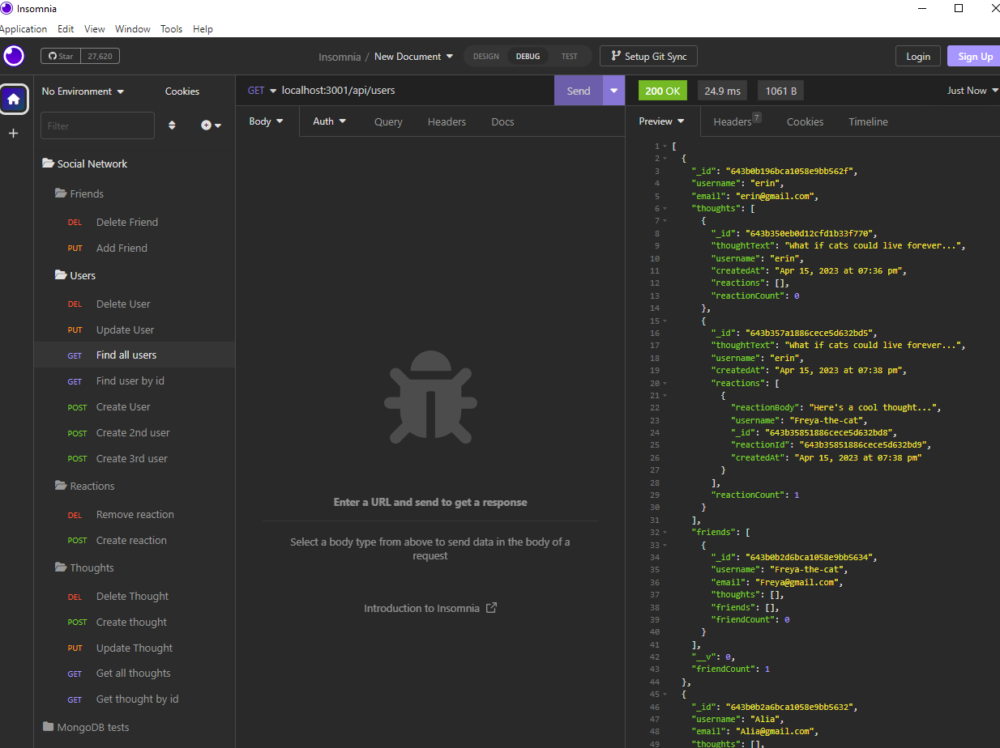

# social-network-API

## Description
This project is the innerworkings of a social media platform.  It uses Express.js, MongoDB, and Mongoose.  In this application, you can create/delete/update a user, add thoughts/reactions to posts, and add/delete friends. 

## Links
- [github repo](https://github.com/erinsawyer504/social-network-API)
- [Link to Demo Video]()

## Table of Contents
- [Installation](#installation)  
- [Usage](#usage)  
- [License](#license)  
- [Constributing](#contributing)  
- [Tests](#tests)  
- [Questions](#questions)

## Installation
Clone the repo into your vs code.  This application also requires node.js, express.js, and MongoDB/mongoose.  Ton install these items, run `npm install` and `npm install mongoose` in the command line. To start the server, type `npm start`.  The port used in this app is 3001. 

## Usage
Here is a screenshot of the app!

## License
This repository is not covered under any license.

## Contributing
To contribute to this application, just fork the repository!

## Tests
This application does not use any tests.

## Questions
GitHub username: erinsawyer504, 
[GitHub profile](https://www.github.com/erinsawyer504)    
Email address: erinsawyer504@gmail.com  
If you have additional questions, please feel free to email me.

